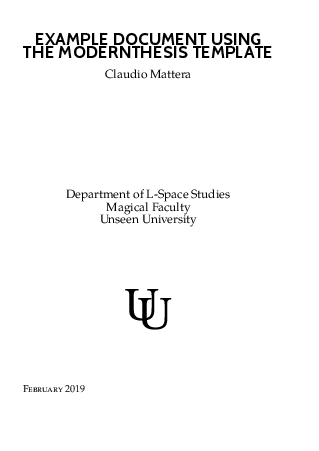
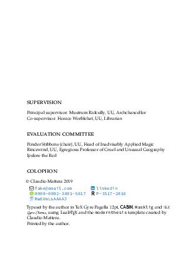
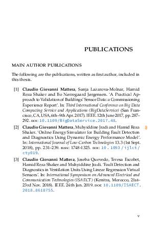
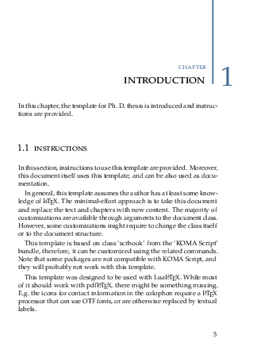

Modern Thesis
====

A (Lua)LaTeX template for a Ph. D. thesis.

Installation
----

The easiest way to install this template is to copy it to your computer and start modifying it.

This template was tested with TeXLive 2019 and 2020, and it should work with any modern LaTeX distribution.
If you did not make a complete installation of your LaTeX distribution, you must manually installed the packages listed in the file [`.ci/dependencies.txt`](.ci/dependencies.txt).

This template was created using [LuaTeX], which offers better support for non-English languages, the ability to use TrueType fonts, and additional features for many packages.
It does also work with the old-fashioned pdfTeX, in which case some minor features are missing.

The example document uses [minted] to highlight source code, which also requires the [Pygments] executable on the path.
This is not required for the template itself, you can safely remove all source code snippets, or replace them with other packages (such as [listings]).

### Fonts Installation

This documents uses the fonts available in the directory [`fonts`](./fonts/).
They must be installed on your system, e.g. on Linux they must be copied to `~/.fonts`, while on Windows they must be installed by opening them with the default application.

[LuaTeX]: http://luatex.org/
[minted]: https://github.com/gpoore/minted
[Pygments]: https://pygments.org/
[listings]: https://www.ctan.org/pkg/listings

Usage
----

The main document is in file [`thesis.tex`](./thesis.tex), which uses the class available in the file [`modernthesis/modernthesis.cls`](./modernthesis/modernthesis.cls), and sets it up with the command `\modernthesissetup`.
The main document also includes the file [`preamble.tex`](./preamble.tex), which is used for the example document, but is not necessary for the template itself.

Afterwards, the main document includes:

- front-matter material from the directory `front-back-matter`;
- individual introductory chapters from the directory `chapters`;
- selected publications from the directory `publications`;
- individual conclusive chapters from the directory `chapters`.

This template is configured to use [latexmk] to generate the final PDF document.
latexmk takes care of running latex, the bibliography processor, the index processor, and all other necessary passes as many times as necessary.
Most LaTeX applications can use latexmk out of the box, otherwise the PDF document can be generated simply using the command

~~~~shell
latexmk
~~~~

In order to use pdfTeX instead of LuaTeX, change the first line in the file [`latexmkrc`](./latexmkrc) to `$pdf_mode = 1`.

### Detailed Instructions

An example document, containing detailed instructions on how to use this template, is available in file [`thesis.pdf`](./thesis.pdf).

[latexmk]: https://www.ctan.org/pkg/latexmk/

License
----

Copyright Claudio Mattera 2020

You are free to copy, modify, and distribute this application with attribution under the terms of the [MIT license]. See the [`License.txt`](./License.txt) file for details.

In practice, you can use this template for your own thesis, book or any kind of document for free.
I would appreciate if you kept the text 'using [...] the modernthesis template created by Claudio Mattera' in the colophon, but it is not a requirement.

### Fonts License

The fonts bundled in the directory [`fonts`](./fonts/) have their own licenses, available in the same directory.
In practice, these are open fonts, and can be used for your own thesis, book or any kind of document for free.

[MIT license]: https://opensource.org/licenses/MIT
